# VoucherVisionGO Editor

A lightweight desktop application for reviewing, verifying, and exporting herbarium specimen transcriptions produced by the [VoucherVisionGO API](https://leafmachine.org/vouchervisiongo/).

Every field from the VoucherVision transcription must be individually accepted before it is included in the final reviewed record — a **zero-trust** approach that ensures data quality.

> **[Try the live demo](http://leafmachine.org/vouchervisiongo/editor-demo.html)** — no download required.

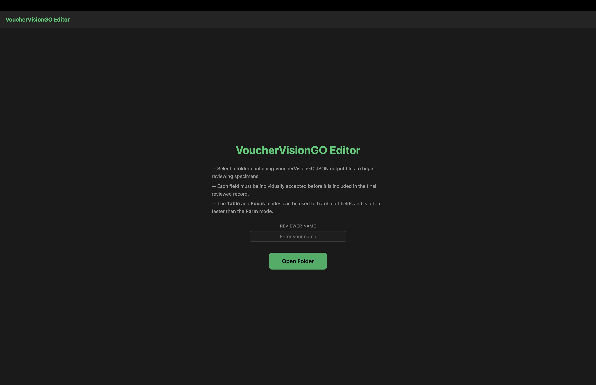

---

## Download

| Platform | Download |
|----------|----------|
| **macOS** (Apple Silicon) | [VoucherVisionGO Editor-1.0.0-arm64.dmg](https://github.com/Gene-Weaver/VoucherVisionGO-Editor/releases/latest) |
| **Windows** (64-bit) | [VoucherVisionGO Editor 1.0.0.exe](https://github.com/Gene-Weaver/VoucherVisionGO-Editor/releases/latest) |
| **Linux** (64-bit) | [VoucherVisionGO Editor-1.0.0.AppImage](https://github.com/Gene-Weaver/VoucherVisionGO-Editor/releases/latest) |

- **macOS:** Open the `.dmg` and drag the app to Applications.
- **Windows:** Double-click the `.exe` — it's portable, no installation or admin rights needed.
- **Linux:** `chmod +x *.AppImage` then double-click or run it.

---

## Quick Start

1. **Download the editor** for your OS (see above).
2. **Use the [VoucherVisionGO API](https://github.com/Gene-Weaver/VoucherVisionGO)** to transcribe a batch of specimen images. Each image produces a JSON file.
3. **Open the editor**, enter your reviewer name, and select the folder containing your transcription JSON files.
4. **Review the transcriptions** using Form, Table, and Focus modes until you are satisfied with their accuracy.
5. **Export an XLSX spreadsheet** with the reviewed data, ready for ingestion into your database.

---

## Folder Structure

When you point the editor at a folder, it looks for VoucherVisionGO JSON output files. As you review, the editor creates `__REVIEWED` copies and a state tracking file alongside your originals.

### Before reviewing

```
my_specimens/
  ├── MICH-V-1122841.json
  ├── ASU0112927_lg.json
  ├── ASU0112928_lg.json
  └── ASU0112929_lg.json
```

### After reviewing is underway

```
my_specimens/
  ├── MICH-V-1122841.json                    ← original (never modified)
  ├── MICH-V-1122841__REVIEWED.json          ← auto-saved reviewed copy
  ├── ASU0112927_lg.json
  ├── ASU0112927_lg__REVIEWED.json
  ├── ASU0112928_lg.json
  ├── ASU0112928_lg__REVIEWED.json
  ├── ASU0112929_lg.json
  ├── _vvgo_editor_state.json                ← tracks review progress
  ├── _vvgo_editor_settings.json             ← your preferences
  └── _prompts/
      └── SLTPvM_geolocate.yaml              ← cached prompt (fetched from GitHub)
```

The `__REVIEWED` files are auto-saved every time you accept or edit a field. They contain a `review_metadata` block with a `complete` flag that becomes `true` when all categories are confirmed. Your original JSON files are **never modified**.

---

## Three Review Modes

### Form Mode

Review one specimen at a time. The left panel shows VoucherVision-suggested values alongside empty fields for your reviewed record. Click the **arrow button** to accept a value, or type your own.

- Fields are organized into **category tabs** (Geography, Taxonomy, Collecting, etc.) based on the prompt used.
- Categories auto-complete when all their fields are resolved.
- The right panel shows the specimen **image**, **map** (with multiple basemap options), **OCR text**, and other metadata.
- Best for **careful, field-by-field review** of individual specimens.

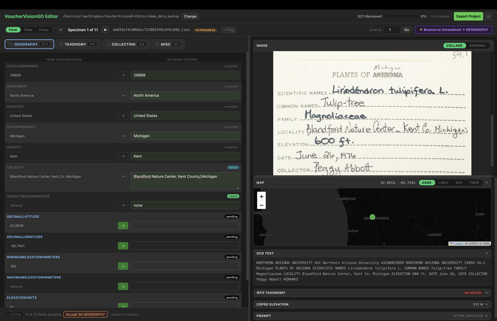

### Table Mode

Review all specimens at once in a spreadsheet-like table. Every field is populated — unreviewed values appear in **gold italic** text, accepted values in normal text.

- **Click any cell** to edit it inline (must unlock editing with the toggle first).
- Editing a cell counts as accepting that value into the reviewed record.
- The right panel shows the **image** for the selected row.
- Use **Enter** to move down a column, **Tab** to move across a row.
- Best for **batch reviewing** fields that are consistent across specimens (e.g., country, collector).

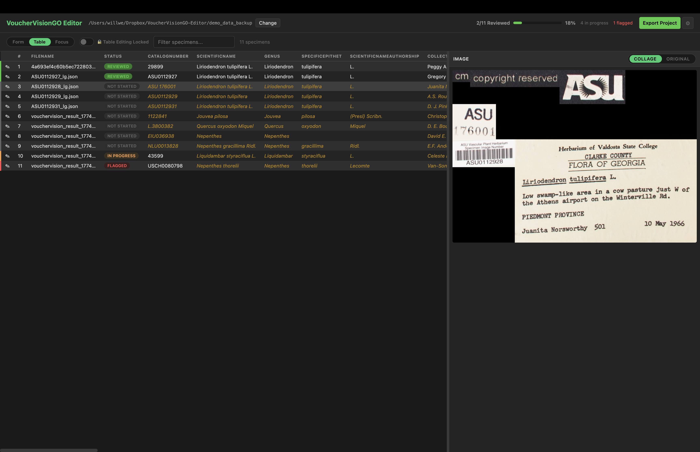

When table editing is enabled, you can quickly change values or confirm values across the entire dataset. Orange italic values have not been reviewed, white values have been reviewed. You can flag troublesome specimens for later review.

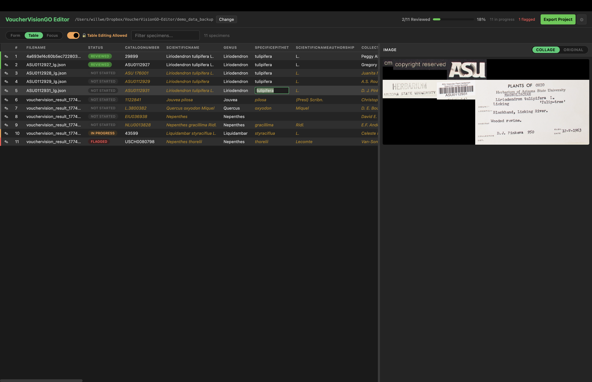

### Focus Mode

Drill into a **single field** across all specimens with data quality tools.

- **Value Distribution** — See every unique value with counts and proportional bars.
- **Clustering** — Automatically detects inconsistencies using fingerprint and n-gram algorithms (e.g., "Mexico" vs "Mexcio" vs "mexico"). Merge variants with one click.
- **Date Format Analysis** — Detects mixed date formats (YYYY-MM-DD, DD/MM/YYYY, etc.) and highlights minorities.
- **Catalog Pattern Analysis** — Identifies structural patterns in catalog numbers and flags outliers.
- **Find & Replace** — Regex-capable search and replace across all specimens.
- **Case Transforms** — Title Case, UPPERCASE, or lowercase for the entire column.
- **Field Confirmation** — Click the checkmark next to any field name to accept all values for that field across every specimen at once.

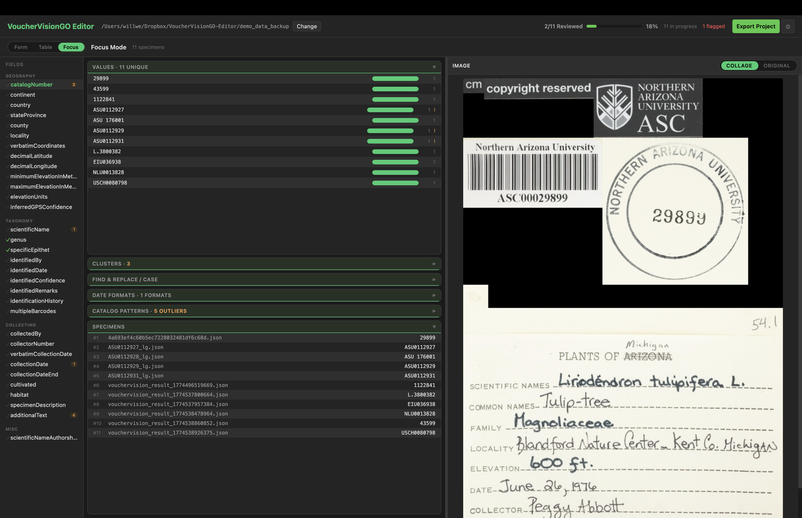

The clustering tool uses fingerprint and n-gram similarity algorithms — the same approaches used by [OpenRefine](https://openrefine.org/) — to automatically detect inconsistent values like case differences, typos, and punctuation variants. Use it to quickly standardize values across all specimens by merging variants into a single canonical form.

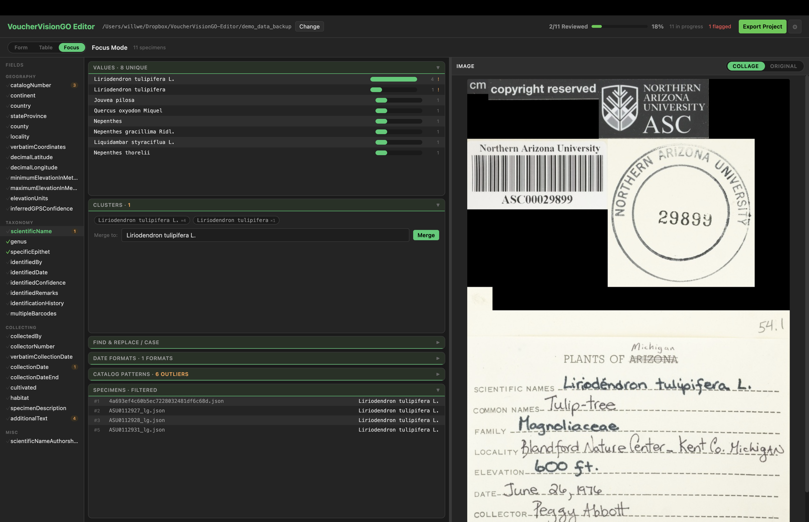

The date format tool applied to verbatim collection dates reveals the variety of formats present in the raw label text — "29 April 1973", "April 29, 1973", "4/29/73", etc. Each format group lists its specimens so you can quickly identify and standardize outliers.

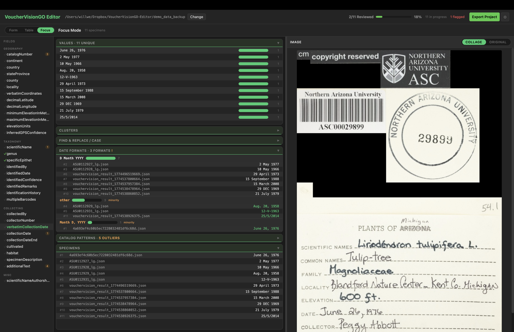

When applied to the formatted collection date field (`collectionDate`), the tool verifies that VoucherVision has consistently standardized dates into the expected ISO format (YYYY-MM-DD), making it easy to spot any that were parsed incorrectly.

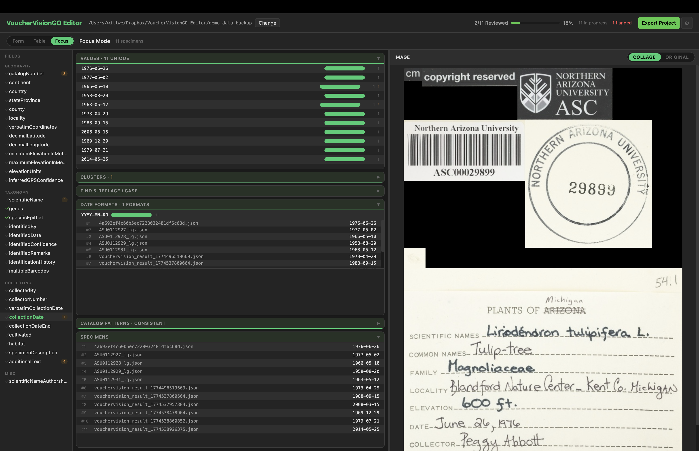

The clustering and data quality tools were inspired by [OpenRefine](https://openrefine.org/). We would love feedback and feature requests for additional tools — please [open an issue](https://github.com/Gene-Weaver/VoucherVisionGO-Editor/issues).

---

## Key Features

### Bounce to Unresolved


The **Bounce to Unresolved** button in the top navigation bar jumps directly to the next specimen and category that has unresolved fields. It searches globally across all specimens, wrapping around to the beginning if needed. When everything is complete, it shows "All Specimens Complete."

### Auto-Save

Every field change triggers an automatic save to a `__REVIEWED.json` file. The `review_metadata.complete` flag tracks whether all fields and categories have been reviewed. You never need to manually save — just review and move on.

### Export Project

Click **Export Project** in the top navigation bar to generate an XLSX spreadsheet. If any specimens are incomplete, the editor will list them and give you the choice to return to reviewing or export anyway (marking incomplete specimens as finalized).

### Settings

Click the **gear icon** in the top navigation bar to customize:

- **Accept All Button** — Enable a button that accepts all VoucherVision values for the current category at once.
- **Row Colors** — Adjust the alternating row shades for form and table views.
- **Category Accent Colors** — Customize the colors for each field category.
- Map theme preference and other settings are also persisted here.

Settings are saved both locally and in the project folder, so they follow your data.

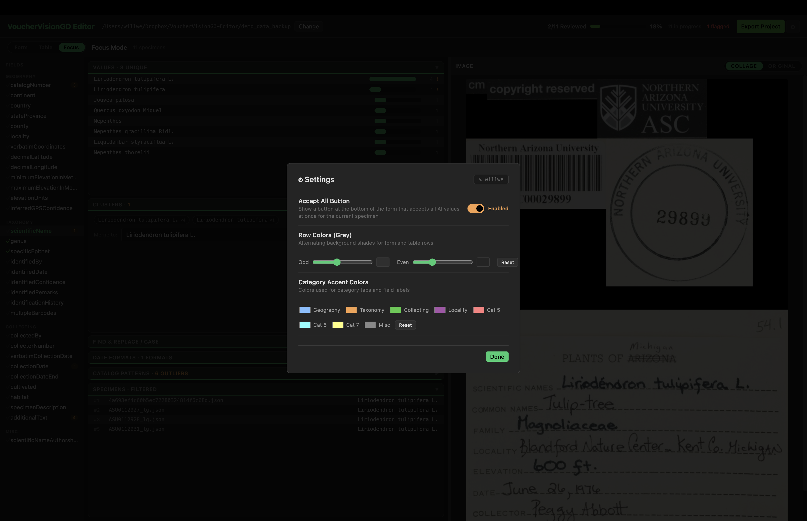

---

## Flexible User Interface

The VV Editor's interface adapts to your workflow. Drag the panel dividers to maximize the image area when you need a closer look, or expand the text inputs when you're focused on data entry. Toggle between the label collage and the full specimen image at any time, and click any image to view it at full resolution.

<table>
  <tr>
    <td><a href="img/view1.png">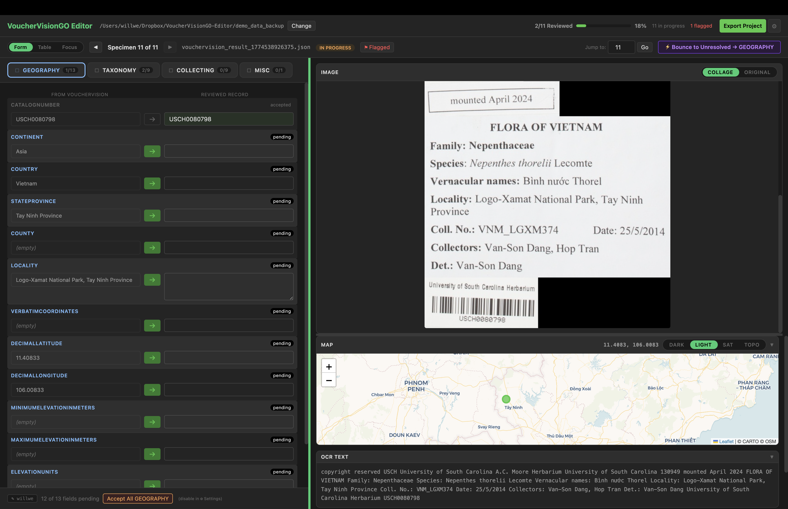</a></td>
    <td><a href="img/view2.png">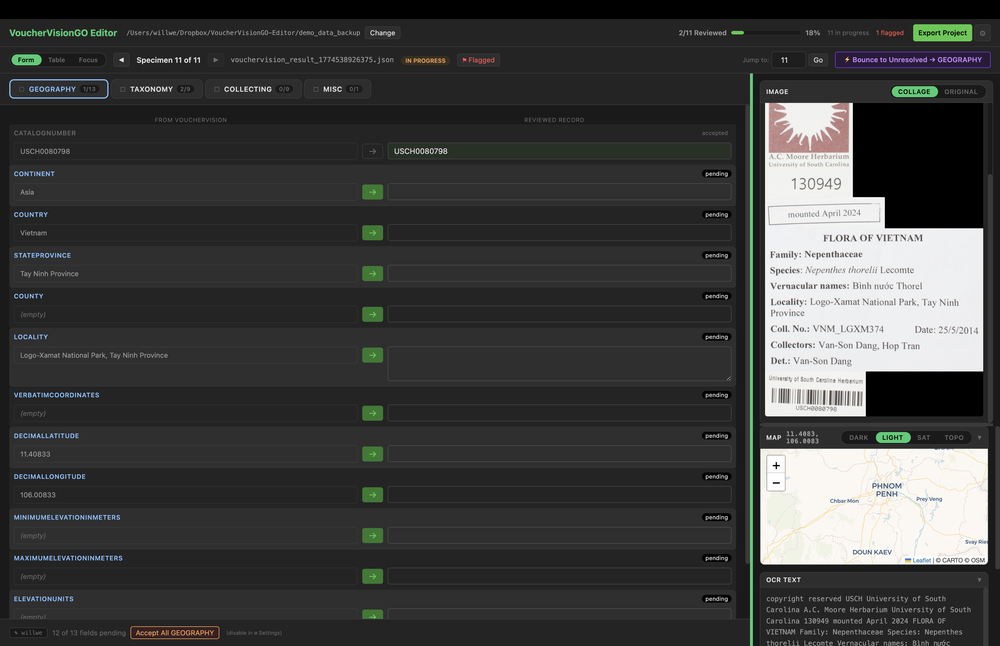</a></td>
  </tr>
  <tr>
    <td><a href="img/view3.png">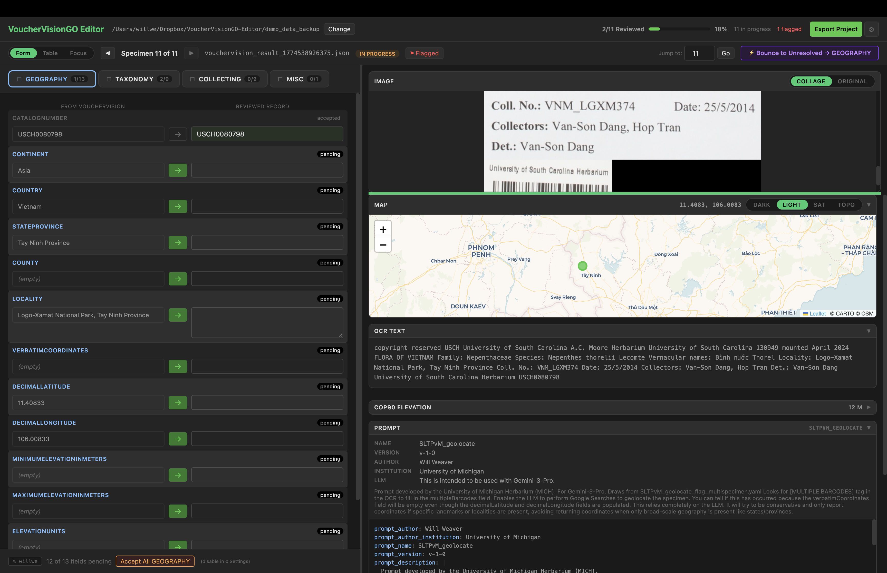</a></td>
    <td><a href="img/view4.png">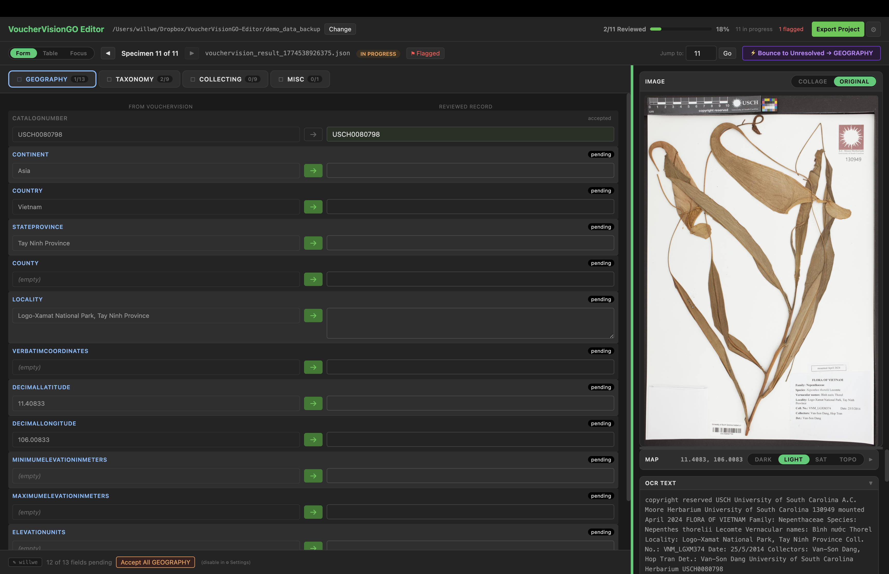</a></td>
  </tr>
  <tr>
    <td><a href="img/view5_zoom.png"></a></td>
    <td><a href="img/view6_zoom.png">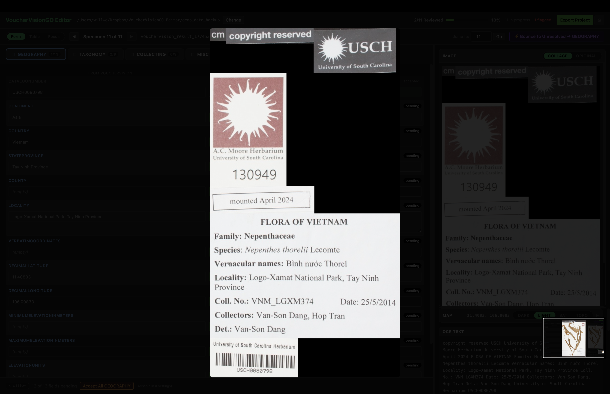</a></td>
  </tr>
</table>

---

## Development (Not for most people!)

```bash
# Install dependencies
npm install

# Run in development mode
npm start

# Build for all platforms
./deploy.sh

# Build demo + update webpage only (skip app builds)
./deploy.sh --skip-builds
```

---

## License

GPL-3.0 — see [LICENSE](LICENSE) for details.

---

## Citation

If you use VoucherVisionGO Editor in your research, please cite:

> Weaver, W.N., Ruhfel, B.R., Lough, K.J. and Smith, S.A. (2023). Herbarium specimen label transcription reimagined with large language models: Capabilities, productivity, and risks. *American Journal of Botany*, 110(11), e16256. https://doi.org/10.1002/ajb2.16256

> Weaver, W. (2026). VoucherVisionGO Editor. https://github.com/Gene-Weaver/VoucherVisionGO-Editor
